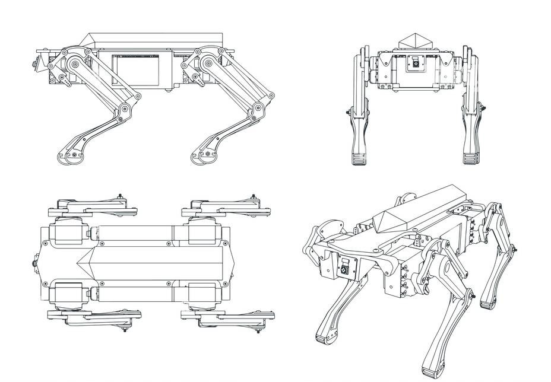

<p align="center">
  <h1 align="center">🐕 Quadruped Robot Mechanical Design</h1>
  <p align="center">
    Initial Mechanical Design Analysis of a Simple Robotic Dog
  </p>
</p>

---

## 📖 Project Overview

This project presents the preliminary mechanical design of a simple quadruped robot (robot dog). The objective is to analyze the fundamental mechanical components required for the robot to stand, maintain balance, and perform basic walking motions.

The design focuses on:

- Body and chassis structure
- Leg mechanism design
- Degrees of freedom (DOF)
- Motor selection
- Preliminary torque calculations
- Stability and center of gravity
- Walking gait strategy
- Expected mechanical challenges

---

## 🖼️ Reference Design

The following quadruped robot design was used as a reference for mechanical analysis.



*Figure 1: Reference quadruped robot mechanical design.*

---

## 🏗️ Body & Chassis Design

The robot uses a rectangular central chassis that houses the electronics, battery, and control system.

### Design Objectives

- Lightweight structure
- High rigidity
- Balanced weight distribution
- Easy maintenance and assembly

The battery and electronics are positioned near the center of the body to improve stability during movement.

---

## 🦿 Leg Design

Each leg consists of:

- Hip Joint
- Upper Leg Link
- Knee Joint
- Lower Leg Link
- Foot Contact Surface

This configuration provides a balance between simplicity and mobility while reducing mechanical complexity.

---

## ⚙️ Degrees of Freedom (DOF)

Each leg contains:

| Joint | Function |
|---------|----------|
| Hip | Forward and backward movement |
| Knee | Leg bending |

### Total DOF

```text
2 DOF per leg
× 4 Legs
= 8 DOF
```

The 8-DOF configuration is sufficient for basic walking and standing operations.

---

## 🔧 Motor Selection

Recommended actuator:

### MG996R Servo Motor

Characteristics:

- High torque output
- Low cost
- Easy control using microcontrollers
- Suitable for lightweight quadruped robots

Alternative:

- DS3218 Servo Motor

for applications requiring higher torque.

---

## 📐 Preliminary Torque Calculation

Assumptions:

```text
Robot Mass = 2 kg
Mass Supported by One Leg = 0.5 kg
Distance from Joint = 0.10 m
```

Force:

```text
F = m × g

F = 0.5 × 9.81

F = 4.9 N
```

Torque:

```text
T = F × d

T = 4.9 × 0.10

T = 0.49 N·m
```

Applying a safety factor of 2:

```text
Required Torque ≈ 1 N·m
```

---

## ⚖️ Stability & Center of Gravity

To maintain stability:

- Heavy components are positioned centrally.
- The robot body remains close to the ground.
- Weight distribution is symmetrical across all four legs.

The center of gravity should remain within the support polygon created by the feet in contact with the ground.

---

## 🚶 Walking Method

### Crawl Gait

Movement sequence:

```text
Front Left
    ↓
Rear Right
    ↓
Front Right
    ↓
Rear Left
```

Advantages:

- High stability
- Low risk of tipping
- Simple implementation

---

## ⚠️ Expected Mechanical Challenges

- Insufficient servo torque
- Joint wear over time
- Leg vibration
- Structural weakness in 3D-printed components
- Battery weight affecting balance
- Increased power consumption during walking

---

## 🎯 Project Goal

The goal of this project is not to create an advanced quadruped robot, but to understand the mechanical principles that allow a robot to stand, balance, and perform basic walking motions.

---

## 👨‍💻 Author

**V**
